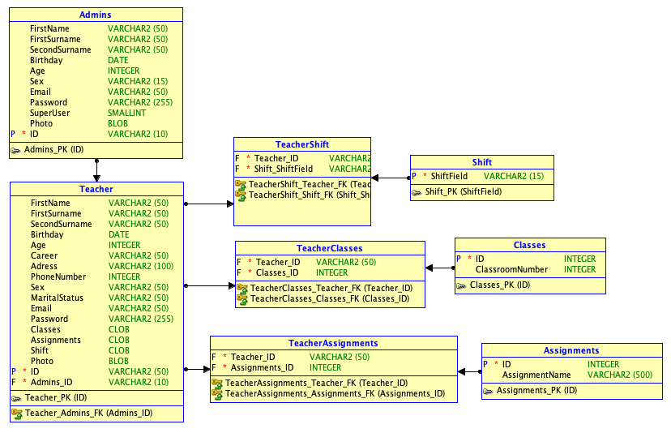
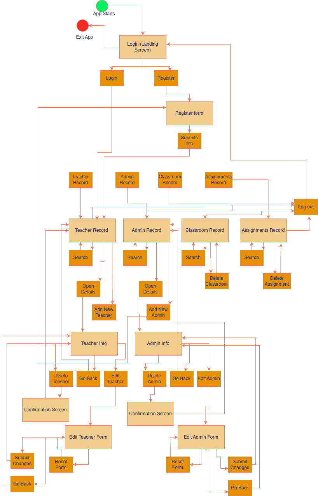
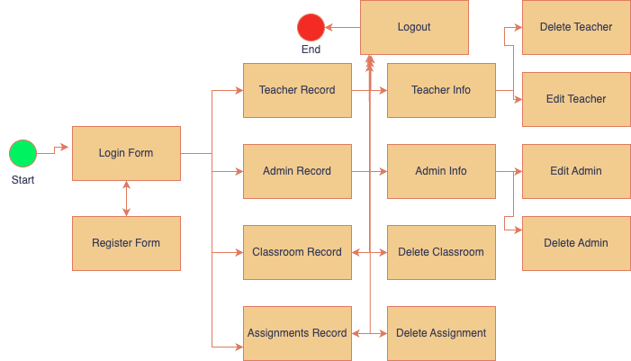
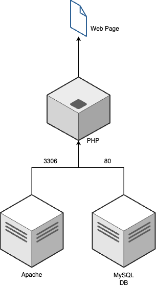
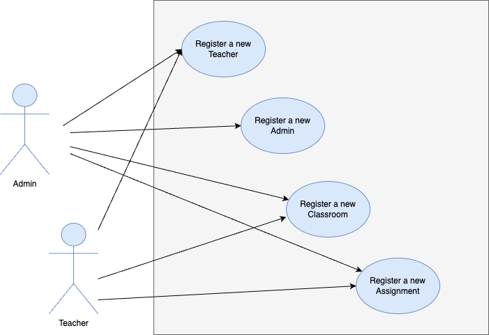
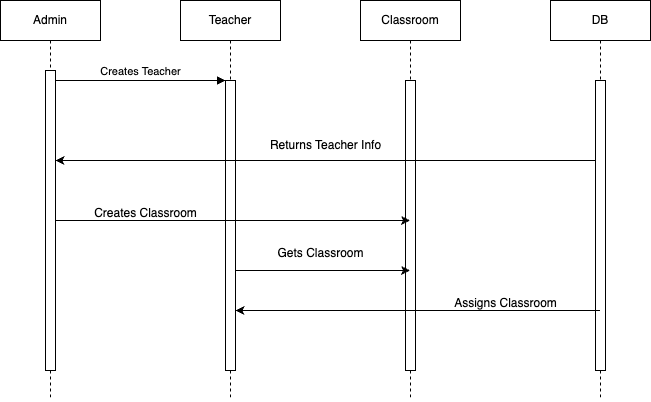
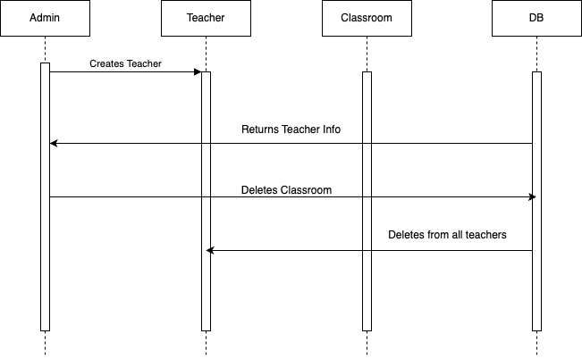

# TeacherRecord
A PHP CRUD involving many web technologies.

This project is focused on maintaining a record of all the teachers registered at the University La Salle. It also aims to gather information related to the professors and the subjects they teach, as well as the classrooms and schedules. The record is managed by admins, who are categorized into two levels: SuperUser and Normal. SuperUsers can edit and delete other administrators, while Normals can only view information about other Admins. Any Admin can delete or alter information about professors, classrooms, subjects, and schedules.

With this project, I aim to offer a lightweight, secure, and fast alternative for maintaining records of teachers, their classrooms, their subjects, and their schedules, providing a responsive, organic, and lightweight interface, using simple and fast technology for easy administration and maintenance.

# Entity-Relationship Diagram

# Interface Navigation Diagram

# Interface Design

# Application Architecture

# Use Case Diagrams

1. Register a new Teacher

Primary Actor: Admin  
Scope: Teachers  
Level: General  

Actors:  
- Admin: Enters the teacher's data  
- Teacher: Gets registered in the system  

Precondition: The admin attempts to log in.  
Postconditions:  
- Identifies the type of user (Super User).

Main Scenario:

The use case begins when the Admin opens the form to register the Teacher.

1. The Admin enters personal information.
2. The Admin enters school information (schedules, classes, and subjects).
3. The Admin enters account information (email, username, and password).
4. The program retrieves the Teacher's data.
5. The program stores the data in the database.
6. The program returns the screen with all the entered information of the Teacher.

Alternative Scenario**:

1. 1a. The Admin enters an invalid email.
   1a1. The program requests a valid email from the Admin.
   1a2. The Admin enters a valid email.
2. 2b. The Admin enters an incorrect password.
   2b1. The program requests a correct password from the Admin.
   2b2. The Admin enters the correct password.
3. 3c. The Admin fails to enter some required data (all are required).
   3c1. The program requests the missing data from the Admin.
   3c2. The Admin enters the complete data.

2. Register a new Admin

Primary Actor: Admin  
Scope: Admins  
Level: General  

-Actors  
- Admin: Enters the data of the new Admin  

Precondition: The admin must be a SuperUser.  
Postconditions:  
- Identifies the type of user (Super User).

-Main Scenario:

The use case begins when the Admin opens the form to register the new Admin.

1. The Admin enters personal information.
2. The Admin enters account information (email, username, and password).
3. The Admin determines the status of the new Admin (SuperUser or not).
4. The program retrieves the new Admin's data.
5. The program stores the data in the database.
6. The program returns the screen with all the entered information of the new Admin.

-Alternative Scenario:

1. 1a. The Admin enters an invalid email.
   1a1. The program requests a valid email from the Admin.
   1a2. The Admin enters a valid email.
2. 2b. The Admin enters an incorrect password.
   2b1. The program requests a correct password from the Admin.
   2b2. The Admin enters the correct password.
3. 3c. The Admin fails to enter some required data (all are required).
   3c1. The program requests the missing data from the Admin.
   3c2. The Admin enters the complete data.

# Sequence Diagrams

